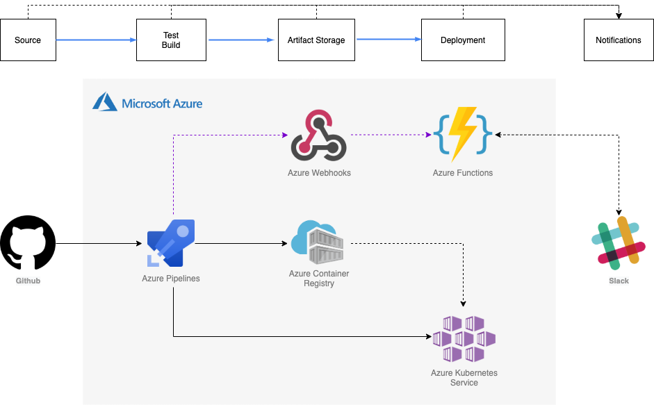
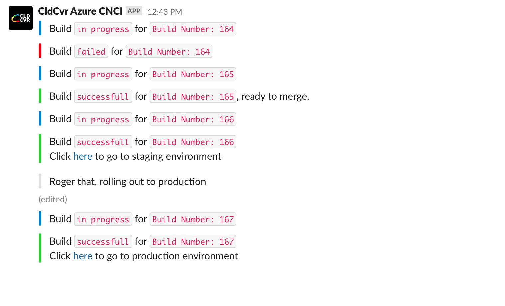

# Cloud Native CI/CD on Azure

## Overview

This repository contains code for the sample application and the azure functions which are extension over azure cloud for the demo of the Cloud Native CI/CD talk given by Vishal Parpia at the Google Cloud Summit Singapore ‘19.

The /app folder contains the sample NodeJs application along with the CloudBuild yaml, Docker files and Kubernetes yaml. The application has some unit tests and integration tests defined which are checked during the build process.

The /azure-cnci-functions folder contains the code for the Azure Functions to listen to Azure Pipelines updates and Slack approval events.


## Process Flow

The source for the application to be deployed is this GitHub repository. When a pull request is raised to the master branch it triggers Azure Pipeline to build and test code based on the PR. If it is successful then the user can merge the PR into the master branch. 

Merging the PR triggers another CloudBuild to perform unit tests, build the Docker image, push the image to Azure Container Repository, deploy it to Kubernetes pods for the staging environment and then perform integration tests.

Notifications at each stage are sent to a Slack channel. 

The user can now decide if he wants to roll out the build to production, this can be done by clicking on YES or NO action buttons which will be showing in the Slack channel to approve the rollout. If the rollout is approved then another Azure Pipeline is executed which deploys it to Kubernetes pods for the production environment.

## Architecture



## Setup Instructions

### Create AKS Clusters

Create two clusters, one for staging environment and other for production. Not down cluster names and deployment zones

### Connecting Repository to Azure Pipelines

* Go to https://dev.azure.com/
* Access your organization
* Create a new project for build pipelines for your project
* Click on Azure Pipelines
* Click on create pipelines -> Click on GitHub -> Give access to the organization -> Then select a repo from the organization.
* Click on AKS for build pipeline to be generated -> Select the resource group -> Then select the Azure Container Registry from where the docker image needs to be deployed. 
* Create 3 pipelines 
  * pr-validator /pr-validator.yml
  * build-deploy-stage /build-deploy-stage.yml
  * build-deploy-prod /build-deploy-prod.yml

### Generate Slack Bot User Token

You can get the bot user token using OAuth2 or from your slack app dashboard (if you are using bot for your own workspace). For more information see: https://api.slack.com/docs/oauth#bots

### Specifying constants

You can specify your configuration constants in azure-cnci-functions/shared_code/config.py replace following values in the config.py with your specific values.

  * **<<organization\>>**: Specify your Azure DevOps organization name.
  * **<<devops_project\>>**: Specify your Azure DevOps project.
  * **<<azure_personal_access_token\>>**: Specify your azure personal access token that would be required to trigger the build pipeline after slack approval.
  * **<<prod_build_pipeline\>>**: Specfiy your prod pipeline e.g., build-deploy-prod
  * **<<prod_build_pipeline\>>**: Specfiy your prod stage e.g., build-deploy-stage
  * **<<stage_env_url\>>**: Specify your stage env url.
  * **<<prod_env_url\>>**: Specify your prod env url.
  * **<<devops_slack_channel\>>**: Slack channnel where all updates needs to be posted.
  * **<<slack_bot_token\>>**: Slack bot token which will post updates to the above channel.
  * **<<git_repo_name\>>**: Git repo name which code needs to build, test and deployed.
  * **<<github_org\>>**: Github organization name.


### Deploy Cloudfunctions

* Deploy Functions
   * Slack Approval Events Listener
   
    ```
    az login
    cd azure-cnci-functions
    func azure functionapp publish azure-cnci-functions --python
    ```

## Screenshots and Demos

